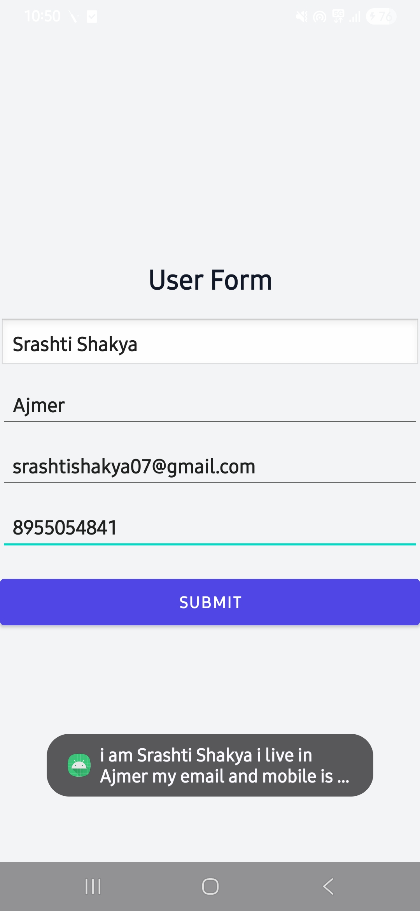
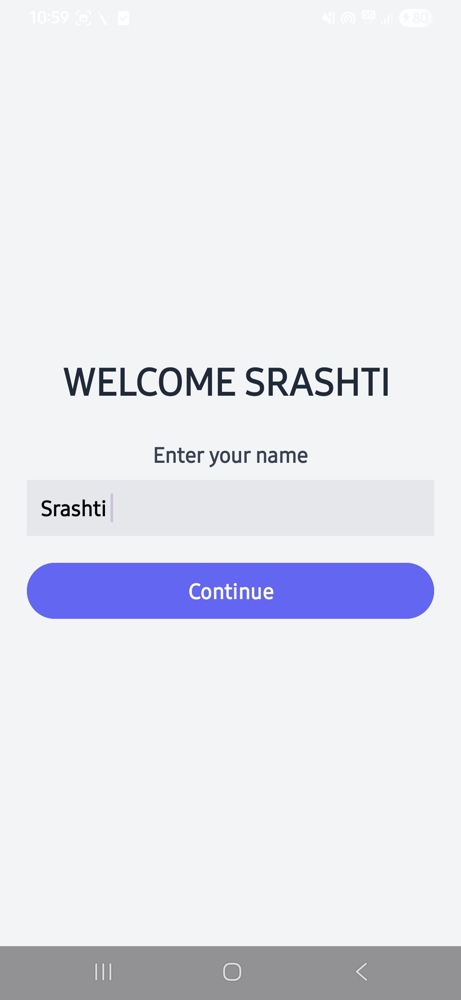
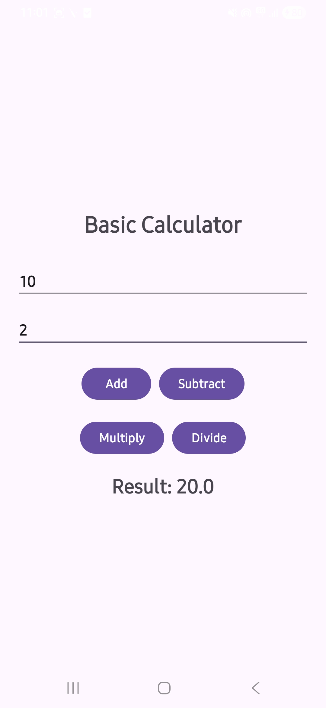
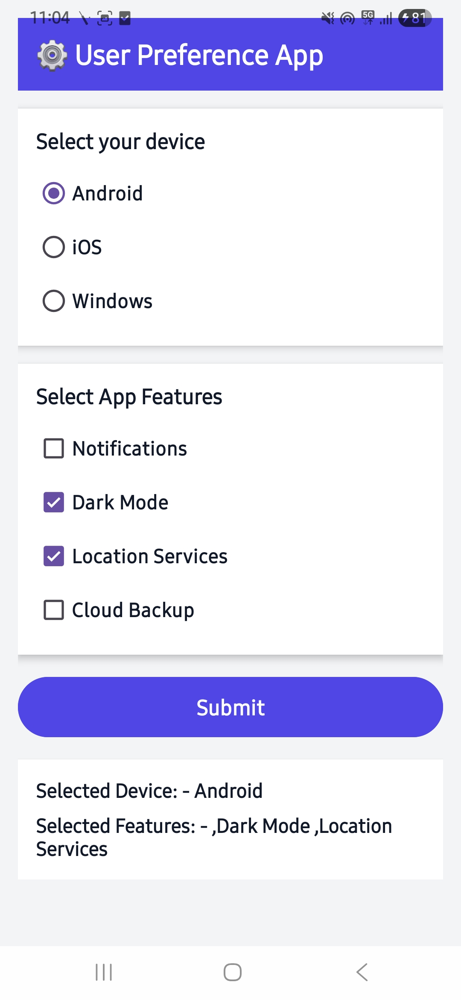
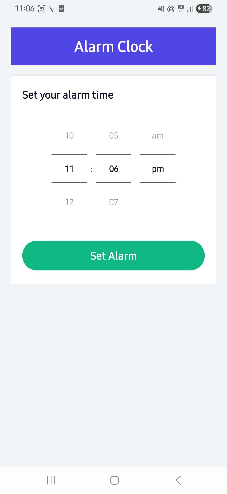
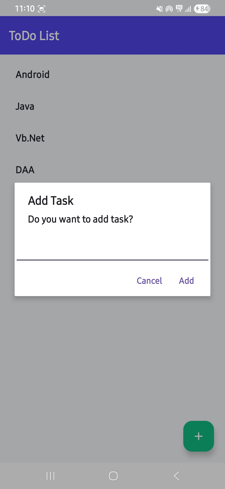
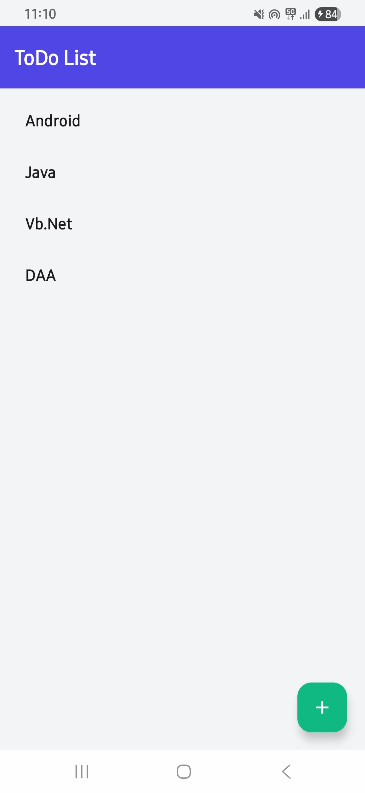
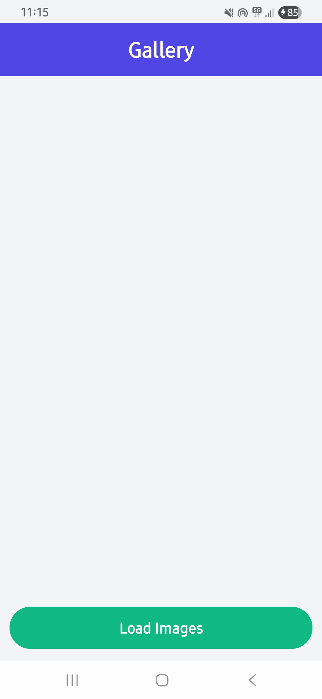
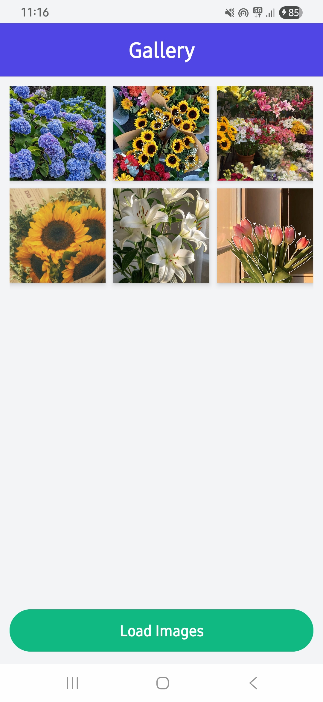
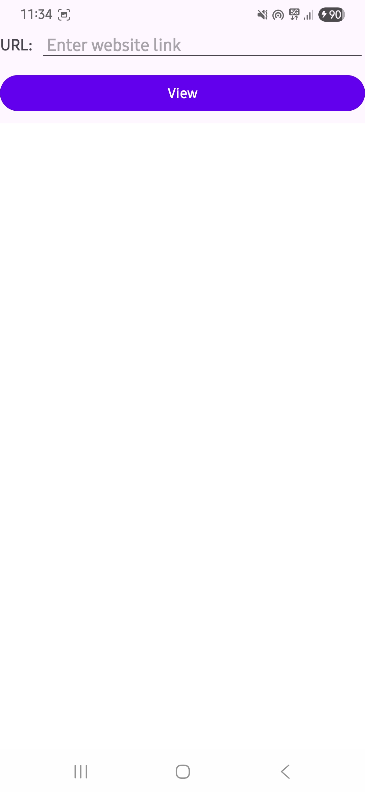

# Android Programming Assignments

---

# 📚 Assignments

## 1️⃣ Assignment 1 – User Form

### Output

---

## 2️⃣ Assignment 2 – Welcom User

### Output

---

## 3️⃣ Assignment 3 – Basic Calculator App

### Output

---

## 4️⃣ Assignment 4 – User Preferance App

### Output

---

## 5️⃣ Assignment 5 – Alarm Clock

### Output

---

## 6️⃣ Assignment 6 – ToDo List

### Output

---

## 7️⃣ Assignment 7 – Image Gallery

### Output

---

## 8️⃣ Assignment 8 – Emergency Alert App

### Output

---

## 9️⃣ Assignment 9 – Web View

### Output

---

## 🔟 Assignment 10 – Calculator App

### Output

---

# 👩‍💻 Submitted By

Srashti Shakya
BCA 2nd Yr.
